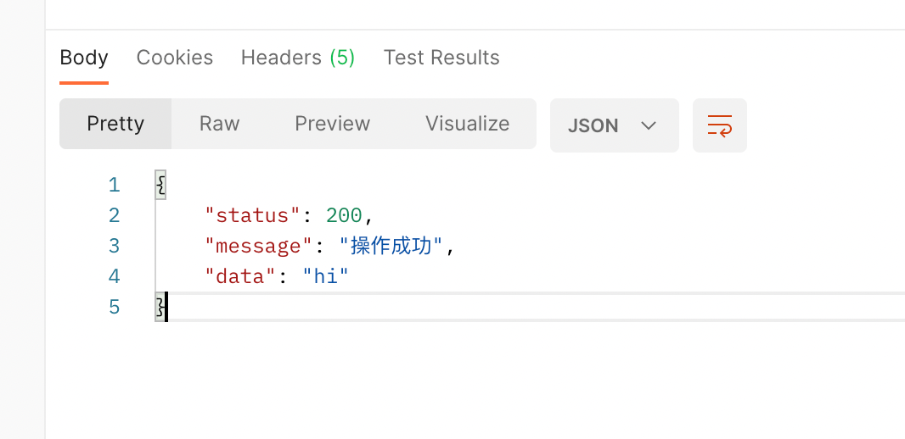
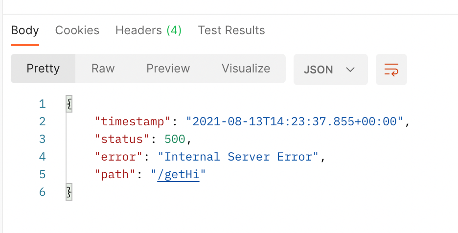
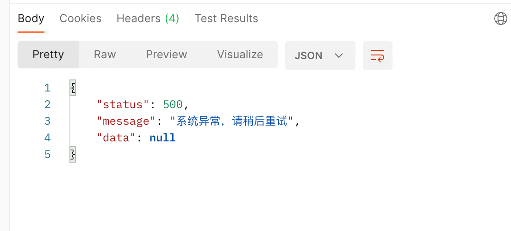
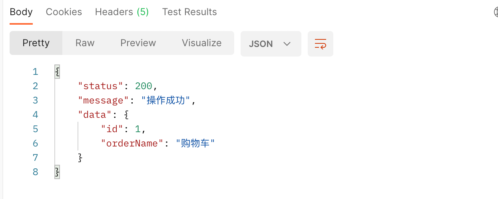
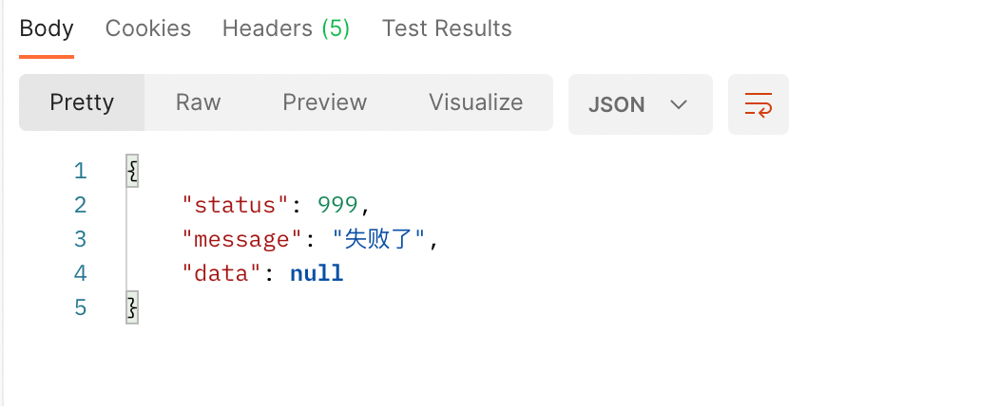

# springboot 优雅的实现统一返回处理

前言：随着前后端分离这种模式的趋势下，后端开发人员更注重后端方面的代码，但是对后端人员在代码编写的过程当中需要越来越规范，这样不仅可以提高开发效率，更可以让代码后期维护起来更加的方便。

这篇文章主要是当接口返回的统一处理，能够让前端人员有个统一的接收后台的接口返回。

## 1、自定义常用的状态码

```java


/**
 * 自定义状态码枚举
 *
 * @author wls
 */
public enum ResultCode {

    /**
     * 操作成功
     **/
    RC200(200, "操作成功"),
    /**
     * 操作失败
     **/
    RC900(900, "操作失败"),
    /**
     * 服务异常
     **/
    RC500(500, "系统异常，请稍后重试");

    /**
     * 自定义状态码
     **/
    private final int code;
    /**
     * 自定义描述
     **/
    private final String message;

    ResultCode(int code, String message) {
        this.code = code;
        this.message = message;
    }


    public int getCode() {
        return code;
    }

    public String getMessage() {
        return message;
    }
}

```

当然可以定义定义一些其他状态码，可以让前端根据不同的状态码进行不同的处理，这里只定义部分常用状态码。

## 2、统一结果返回包装类

```java
package com.example.spring.response.constant;

import lombok.Data;

/**
 * 自定义结果包装类
 *
 * @author wls
 */
@Data
public class ResultData<T> {
    /**
     * 状态码
     */
    private int status;
    /**
     * 返回消息
     */
    private String message;
    /**
     * 返回的结果
     */
    private T data;
    

    /**
     * 有结果返回值操作成功
     *
     * @param data 数据
     * @param <T>  泛型
     * @return 包装结果
     */
    public static <T> ResultData<T> success(T data) {
        ResultData<T> resultData = new ResultData<>();
        resultData.setStatus(ResultCode.RC200.getCode());
        resultData.setMessage(ResultCode.RC200.getMessage());
        resultData.setData(data);
        return resultData;
    }

    /**
     * 无结果返回值操作成功
     *
     * @param <T>  泛型
     * @return 包装结果
     */
    public static <T> ResultData<T> success() {
        ResultData<T> resultData = new ResultData<>();
        resultData.setStatus(ResultCode.RC200.getCode());
        resultData.setMessage(ResultCode.RC200.getMessage());
        return resultData;
    }

    /**
     * 有状态码的失败
     *
     * @param code    状态码
     * @param message 失败消息
     * @param <T>     泛型
     * @return 包装失败
     */
    public static <T> ResultData<T> fail(int code, String message) {
        ResultData<T> resultData = new ResultData<>();
        resultData.setStatus(code);
        resultData.setMessage(message);
        return resultData;
    }

    /**
     * 无状态码的失败
     *
     * @param message 失败消息
     * @param <T>     泛型
     * @return 包装失败
     */
    public static <T> ResultData<T> fail( String message) {
        ResultData<T> resultData = new ResultData<>();
        resultData.setStatus(ResultCode.RC999.getCode());
        resultData.setMessage(message);
        return resultData;
    }

}
```

这里只封装的部分方法，可以根据自己的实际需求封装不同方法。


**写一个简单的请求demo**

```java
 @GetMapping("/getHi")
    public ResultData<String> getHi(){
        return ResultData.success("hi");
    }
```

**返回结果**



**模拟一个服务器的异常**

```java
@GetMapping("/getHi")
    public ResultData<String> getHi(){
        int a = 1/0;
        return ResultData.success("hi");
    }
```

**结果**



这种返回结果肯定不是前端开发人员想处理的，所以我们还要对服务端如果出现一个异常，也需要处理统一的返回格式。

## 3、自定义异常类，以及全局异常处理

```java
package com.example.spring.response.exception;

import com.example.spring.response.constant.ResultCode;

/**
 * 自定义义务异常
 * @author wls
 */
public class BizException extends RuntimeException {

    public ResultCode resultCode;

    public BizException(String message) {
        super(message);
    }

    public BizException(ResultCode resultCode) {
        super(resultCode.getMessage());
        this.resultCode = resultCode;
    }

    @Override
    public String getMessage() {
        return super.getMessage();
    }

}

```

```java
package com.example.spring.response.handler;

import com.example.spring.response.constant.ResultCode;
import com.example.spring.response.constant.ResultData;
import com.example.spring.response.exception.BizException;
import lombok.extern.slf4j.Slf4j;
import org.springframework.http.HttpStatus;
import org.springframework.web.bind.annotation.ExceptionHandler;
import org.springframework.web.bind.annotation.ResponseStatus;
import org.springframework.web.bind.annotation.RestControllerAdvice;

/**
 * 全局统一异常处理
 * @author wls
 */
@Slf4j
@RestControllerAdvice
public class RestExceptionHandler {

    /**
     * 自定义异常处理。
     * @param e the e
     * @return ResultData
     */
    @ExceptionHandler(BizException.class)
    @ResponseStatus(HttpStatus.EXPECTATION_FAILED)
    public ResultData<String> exception(BizException e) {
        log.error("全局异常信息 e={}", e.getMessage(), e);
        return ResultData.fail(e.getMessage());
    }
    /**
     * 默认全局异常处理。
     * @param e the e
     * @return ResultData
     */
    @ExceptionHandler(Exception.class)
    @ResponseStatus(HttpStatus.INTERNAL_SERVER_ERROR)
    public ResultData<String> exception(Exception e) {
        log.error("全局异常信息 e={}", e.getMessage(), e);
        return ResultData.fail(ResultCode.RC500.getCode(),e.getMessage());
    }

}
```

**运行结果**



能够正确的返回。

当时回头一想，统一处理但是每次返回结果的时候自己都得重复手动包装一下自定义的类，这样可以用代码来处理，所以下面实现自动包装返回的结果。

## 4、自定义自动包装统一返回类

```java
package com.example.spring.response.handler;

import com.example.spring.response.constant.ResultData;
import com.fasterxml.jackson.databind.ObjectMapper;
import lombok.SneakyThrows;
import org.springframework.beans.factory.annotation.Autowired;
import org.springframework.core.MethodParameter;
import org.springframework.core.io.Resource;
import org.springframework.http.MediaType;
import org.springframework.http.converter.HttpMessageConverter;
import org.springframework.http.server.ServerHttpRequest;
import org.springframework.http.server.ServerHttpResponse;
import org.springframework.web.bind.annotation.RestControllerAdvice;
import org.springframework.web.servlet.mvc.method.annotation.ResponseBodyAdvice;

/**
 * 统一包装返回结果
 *
 * @author wls
 */
@RestControllerAdvice
public class ResponseAdvice implements ResponseBodyAdvice<Object> {
    @Autowired
    private ObjectMapper objectMapper;

    @Override
    public boolean supports(MethodParameter methodParameter, Class<? extends HttpMessageConverter<?>> aClass) {
        //返回true则对返回值需要处理
        return true;
    }

    /**
     * 接口返回前包装结果
     */
    @SneakyThrows
    @Override
    public Object beforeBodyWrite(Object o, MethodParameter methodParameter, MediaType mediaType, Class<? extends HttpMessageConverter<?>> aClass, ServerHttpRequest serverHttpRequest, ServerHttpResponse serverHttpResponse) {
        //如果是String类型，转为json
        if (o instanceof String) {
            return objectMapper.writeValueAsString(ResultData.success(o));
        }
        //如果异常、文件形式，直接返回
        if (o instanceof ResultData || o instanceof Resource ) {
            return o;
        }
        return ResultData.success(o);
    }
}
```

写个demo测试一下

```java
 @GetMapping("getWorld")
    public Order getWorld(){
        return new Order(1L,"购物车");
    }

    @GetMapping("/getError")
    public Order getError(){
        throw new BizException("失败了");
    }
```

返回结果：



这样就可以优雅的实现统一返回值的处理。

### 注意:

特别注意这个类的判断！！！